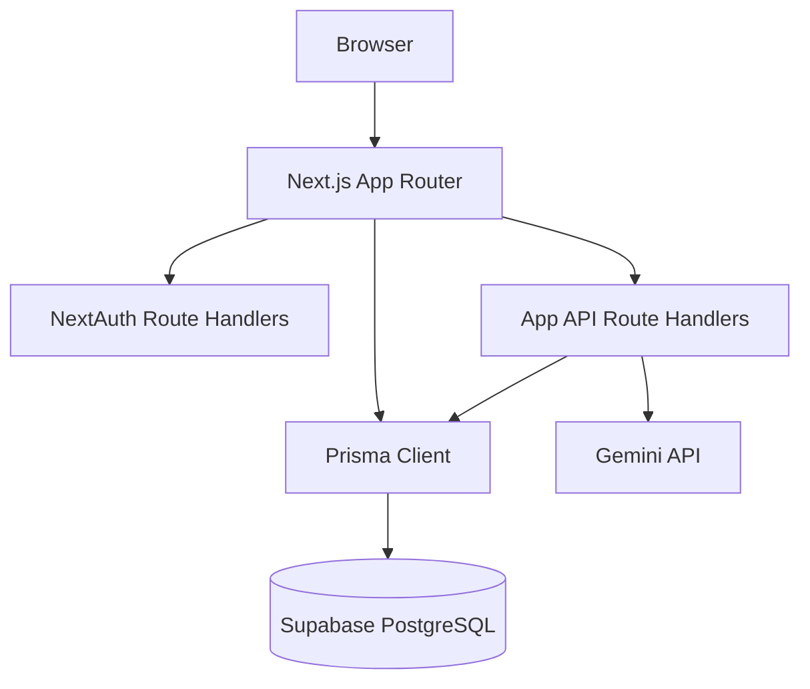
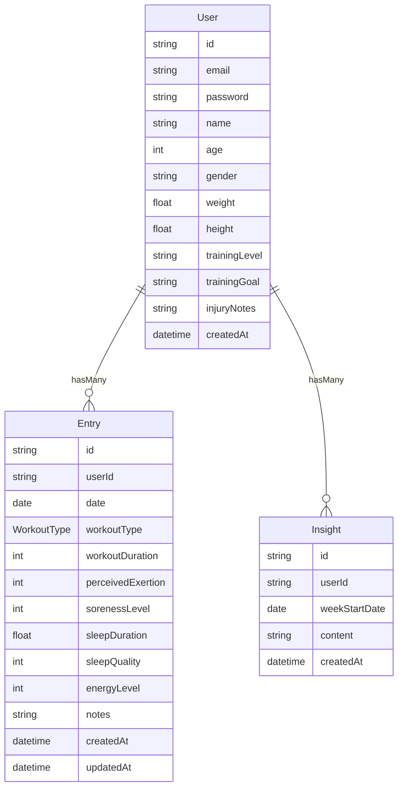

# ResetFlo

ResetFlo is a recovery journal that helps active people track workouts, sleep, soreness, and energy in one place. It provides personalized recovery insights, secure authentication, and generates AI-assisted guidance from their recent trends.

## Demo


## Test Credentials

> **Demo Login**
>
> - Email: `demo@example.com`
> - Password: `password123`

## Why This Matters

Most fitness apps track workouts well, but recovery signals such as soreness, sleep quality, and daily energy are often scattered or ignored. That makes it hard to identify when training load should be adjusted.

People also need fast feedback from recent patterns, not just raw logs. ResetFlo combines daily inputs with trend analysis so users can make better decisions before fatigue accumulates.

By keeping entries, profile context, and insights in one workflow, the app reduces friction and gives users a clearer weekly recovery picture.

## Key Features

| Feature (plain English) | Technical implementation |
| --- | --- |
| Secure login and registration | NextAuth Credentials provider with bcrypt password hashing and JWT session strategy |
| One entry per day tracking | Prisma `Entry` model with `@@unique([userId, date])` to prevent duplicate daily records |
| Rich recovery input model | Workout type, duration, exertion, soreness, sleep quality/duration, energy, and notes persisted via Prisma |
| Protected user dashboard and history | Server-side `getAuthSession()` checks in protected pages and API route handlers |
| Reliable entry writes | `POST`/`PUT` entry mutations validated with Zod before database writes |
| AI insight generation with safety guardrails | Gemini generation requires minimum history, handles safety blocks, and applies server-side rate-limit cooldown |
| Profile-driven context | Optional profile fields (training goal, level, injury notes, body metrics) inform downstream insights |

## Tech Stack

- **Frontend:** Next.js App Router, React, Tailwind CSS  
  Chosen for integrated full-stack routing, server rendering, and fast UI iteration.
- **Authentication:** NextAuth.js (Credentials, JWT sessions)  
  Chosen for battle-tested auth flows that fit server-rendered Next.js apps.
- **Database:** Supabase PostgreSQL + Prisma ORM  
  Chosen for relational reliability, easy hosted Postgres, and schema migrations.
- **Validation:** Zod  
  Chosen for explicit runtime validation at API boundaries.
- **Charts:** Recharts  
  Chosen for lightweight trend visualizations in React dashboards.
- **AI:** Google Gemini (`@google/generative-ai`)  
  Chosen for straightforward API integration and useful natural-language summaries.

## Architecture



## ER Diagram

<details>
<summary>Show/Hide ER Diagram</summary>



`WorkoutType` enum values: `STRENGTH`, `CARDIO`, `MOBILITY`, `REST`, `OTHER`.

</details>

## Getting Started (Local Development)

### 1) Install dependencies

```bash
npm install
```

### 2) Configure environment variables

Copy `.env.example` to `.env.local` and fill values.

```bash
cp .env.example .env.local
```

For Prisma CLI commands, mirror values into `.env` if needed:

```bash
cp .env.local .env
```

### 3) Generate Prisma client

```bash
npm run postinstall
```

### 4) Run migrations locally

```bash
npx prisma migrate dev
```

### 5) Start dev server

```bash
npm run dev
```

App runs at [http://localhost:5000](http://localhost:5000).

## Deployment Guide

### Supabase (Database)

Create a Supabase Postgres project and copy both connection strings:

- `DATABASE_URL` for pooled runtime usage (typically port `6543`)
- `DIRECT_URL` for Prisma migration usage (typically port `5432`)

Run migrations from your local machine or controlled CI, not from browser-exposed clients.

### Vercel (Frontend + API)

Import this repository into Vercel, configure all required environment variables for each environment, deploy, and ensure `NEXTAUTH_URL` matches your deployed domain.

## Seed Demo Data

Run the seed script to create sample data:

```bash
npx prisma db seed
```

Then sign in with the test credentials listed above.

## Environment Variables

<details>
<summary>Show/Hide Environment Variables</summary>

| Variable | Example value | Description |
| --- | --- | --- |
| `DATABASE_URL` | `postgresql://postgres.<ref>:<password>@...:6543/postgres?pgbouncer=true&connection_limit=1&sslmode=require` | Runtime pooled database connection string |
| `DIRECT_URL` | `postgresql://postgres:<password>@db.<ref>.supabase.co:5432/postgres?sslmode=require` | Direct database connection for Prisma migrations |
| `NEXTAUTH_SECRET` | `replace-with-strong-random-secret` | Secret used to sign/verify auth sessions |
| `NEXTAUTH_URL` | `http://localhost:5000` | Canonical app URL for auth callbacks |
| `GEMINI_API_KEY` | `your-gemini-api-key` | API key for AI insight generation |

</details>

## API Reference

<details>
<summary>Show/Hide API Reference</summary>

| Method | Endpoint | Auth required | Description |
| --- | --- | --- | --- |
| `POST` | `/api/auth/register` | No | Register a new user account |
| `GET` | `/api/auth/[...nextauth]` | No | NextAuth handler endpoints (session/auth flows) |
| `POST` | `/api/auth/[...nextauth]` | No | NextAuth handler endpoints (credentials callbacks) |
| `GET` | `/api/profile` | Yes | Return current authenticated user profile |
| `PUT` | `/api/profile` | Yes | Update current authenticated user profile |
| `GET` | `/api/entries` | Yes | List entries with pagination and optional date window |
| `POST` | `/api/entries` | Yes | Upsert a daily entry by date |
| `GET` | `/api/entries/[id]` | Yes | Fetch one entry owned by the current user |
| `PUT` | `/api/entries/[id]` | Yes | Update one entry owned by the current user |
| `GET` | `/api/insights` | Yes | Return latest generated insight |
| `POST` | `/api/insights` | Yes | Generate and save a new insight |

</details>

## Security Features

- Passwords are hashed with bcrypt before persistence.
- Session handling uses NextAuth JWT strategy and server-side verification on protected routes.
- API mutation payloads are validated with Zod before database writes.
- Daily entries are protected by a uniqueness constraint to prevent duplicate writes per user/date.
- Database tables use Row Level Security in Supabase with Prisma role policies for backend-only access.
- Environment secrets are kept in `.env` files and excluded from git by default.

## What I Learned

Keeping the API inside Next.js Route Handlers reduced infrastructure complexity and made it easier to reason about auth and data access in one codebase.

Runtime validation with Zod was essential even with TypeScript because external request bodies are untrusted. It prevented malformed writes from reaching Prisma.

Modeling daily entries with a strict user/date uniqueness constraint simplified both UX and data integrity. It made upsert behavior predictable and reduced deduplication logic.

Treating AI insights as an additive layer instead of a hard dependency kept the core journaling workflow useful even when insight generation is unavailable or rate-limited.

## Troubleshooting

- **Auth redirects/500 in production:** confirm `NEXTAUTH_SECRET` is set.
- **Prisma client errors in build:** confirm `postinstall` ran and generated client.
- **Date appears off by one day:** ensure client sends `YYYY-MM-DD` local date strings.
- **Insight generation 429:** respect cooldown and retry after a short wait.

## Roadmap

- Add automated unit and integration tests for entry and insight flows.
- Add weekly digest delivery (email or in-app summary).
- Add coach-view and multi-user comparison workflows.
- Add CSV export for entries and insight history.
